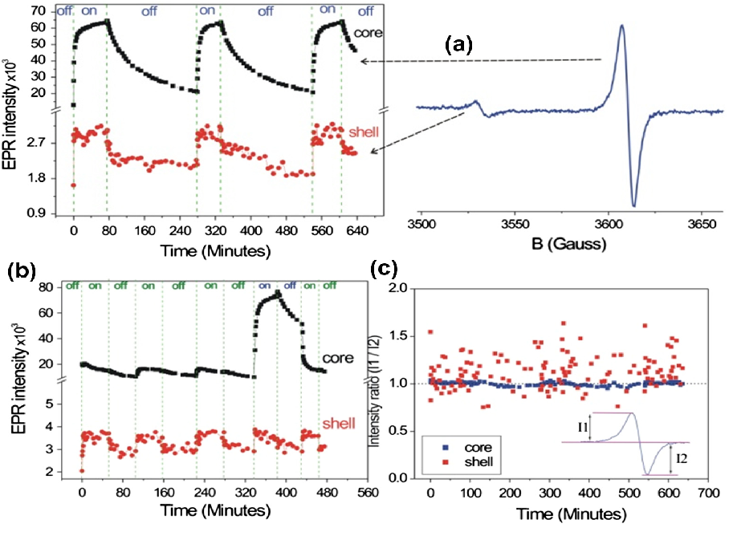

tags:: [[project/CasZnO]]
date:: 08/2014
issn:: 09258388
doi:: 10.1016/j.jallcom.2014.03.157
title:: @Microwave power, temperature, atmospheric and light dependence of intrinsic defects in ZnO nanoparticles: A study of electron paramagnetic resonance (EPR) spectroscopy
pages:: 34-44
volume:: 605
item-type:: [[journalArticle]]
access-date:: 2024-06-20T17:32:29Z
original-title:: "Microwave power, temperature, atmospheric and light dependence of intrinsic defects in ZnO nanoparticles: A study of electron paramagnetic resonance (EPR) spectroscopy"
language:: en
url:: https://linkinghub.elsevier.com/retrieve/pii/S0925838814007567
short-title:: "Microwave power, temperature, atmospheric and light dependence of intrinsic defects in ZnO nanoparticles"
publication-title:: Journal of Alloys and Compounds
journal-abbreviation:: Journal of Alloys and Compounds
authors:: [[Emre Erdem]]
library-catalog:: DOI.org (Crossref)
links:: [Local library](zotero://select/library/items/9K8IZ8EL), [Web library](https://www.zotero.org/users/9044942/items/9K8IZ8EL)

- Overall I don't know if I would trust this paper
- They state that under blue light the core (or bulk) signal is enhanced more than the shell (or surface) signal
	- Opposite to what is stated in [[@Photoactivity under visible light of defective ZnO investigated by EPR spectroscopy and photoluminescence]]
	- 
- (?) Annealing enlarges the linewidths, that then go back to the previous value in some hours
	- Here they mention only changes in the linewidth immediatly after annealing. No mention at all about intensity. This is not something that they report in [[@Role of the paramagnetic donor-like defects in the high n-type conductivity of the hydrogenated ZnO microparticles]].