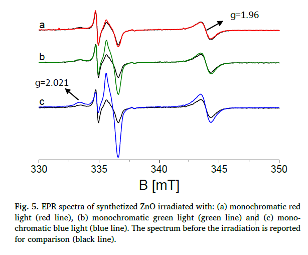

tags:: [[projects/CasZnO]]
date:: 06/2020
issn:: 10106030
doi:: 10.1016/j.jphotochem.2020.112531
title:: @Photoactivity under visible light of defective ZnO investigated by EPR spectroscopy and photoluminescence
pages:: 112531
volume:: 397
item-type:: [[journalArticle]]
access-date:: 2024-06-20T08:43:37Z
original-title:: Photoactivity under visible light of defective ZnO investigated by EPR spectroscopy and photoluminescence
language:: en
url:: https://linkinghub.elsevier.com/retrieve/pii/S1010603020303300
publication-title:: Journal of Photochemistry and Photobiology A: Chemistry
journal-abbreviation:: Journal of Photochemistry and Photobiology A: Chemistry
authors:: [[Erik Cerrato]], [[Maria Cristina Paganini]], [[Elio Giamello]]
library-catalog:: DOI.org (Crossref)
links:: [Local library](zotero://select/library/items/XCAY57E3), [Web library](https://www.zotero.org/users/9044942/items/XCAY57E3)

- From the supplementary information I estimated $22 W/m^2 / 2 \cdot 50nm \cdot (0.1 m)^2 = 50 mW$ of power that they used with the blue laser
- They claim that the blue light has an influence on the surface defects mostly, while red and green do almost change nothing
	- 