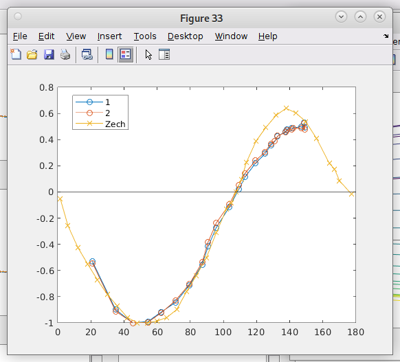

## OOP vs BETA
	- The shapes of the ESEEM echoes look fine
	- I kept the mwf at the same position of the critically coupled resonance, therefore even if the attenuation is 0dB only a 13.6 ns corresponds to a pi pulse
	- I was using pulse lenghts of p1 = 12 ns therefore even when the MPFU amplitude of both channels was maximum I had an absorptive signal in the imaginary channel
- 
-